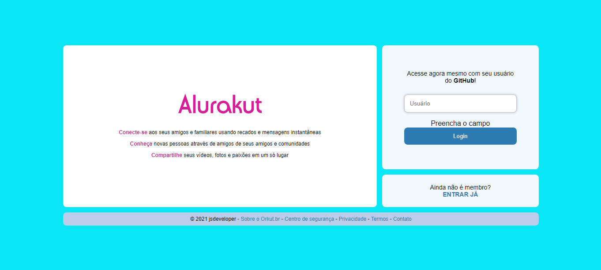
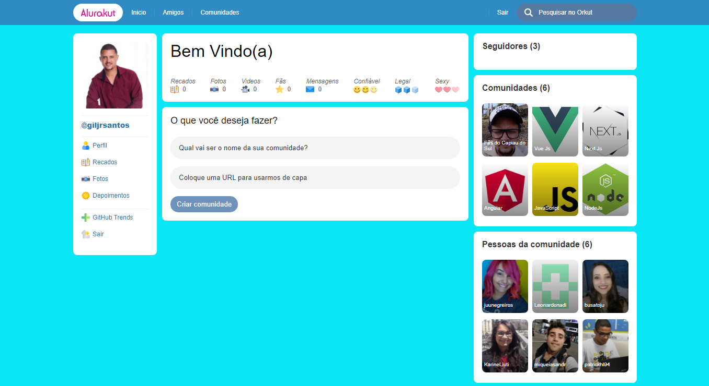

# AluraKut

Dessa fez a Imersão React 3ª Edição que a Alura promoveu, foi para fazermos a tela de login, e a tela de principal do antigo ORKUT.

## Tela de login
    Nessa tela, para logar no sistema deve usar o seu usuário do GitHub.
    
    E se o usuário for válido, vai ser redirecionado para a tela principal do ORKUT.

  

## Tela Princial
    Essa tela a pessoa que logar, pode cadastrar uma comunidade. 
    
    E a comunidade é salva [Dato CMS](https://www.datocms.com/).

    E as pessoas da comunidades, são [followers] do GitHub

  

# DEPENDÊNCIAS
    "datocms-client": "^3.4.11",
    "jsonwebtoken": "^8.5.1",
    "next": "latest",
    "nookies": "^2.5.2",
    "react": "^17.0.2",
    "react-dom": "^17.0.2",
    "react-is": "^17.0.2",
    "styled-components": "^5.2.3"

# DEPENDÊNCIAS DE DESENVOLVIMENTO
    "babel-plugin-styled-components": "^1.12.0"  
